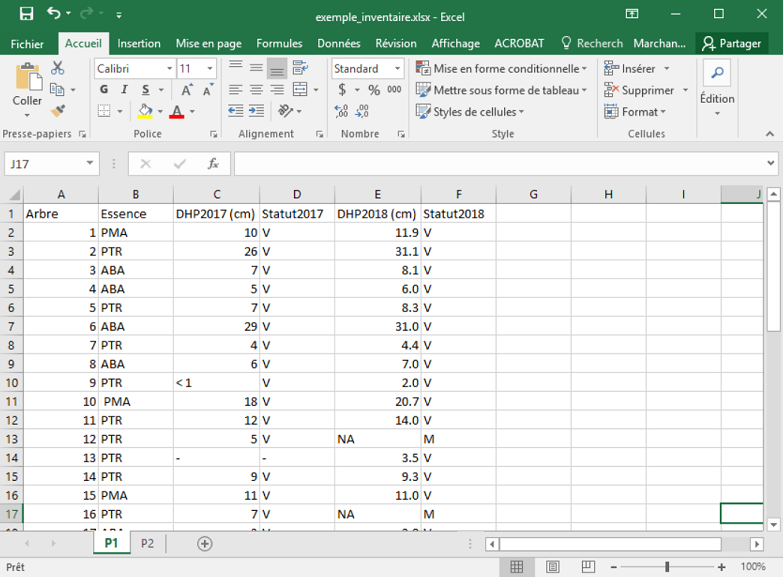
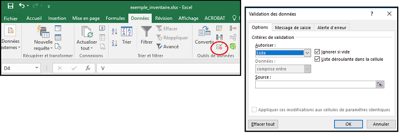

```{r setup, include=FALSE}
knitr::opts_chunk$set(echo = TRUE)
```

# Introduction

Le but de cet atelier est, d'une part, de présenter des lignes directrices pour l'organisation de données qui facilitent leur analyse, d'autre part, d'illustrer des fonctions R qui permettent de réorganiser rapidement plusieurs jeux de données. En particulier, nous allons:

- détecter des erreurs de saisie de données;

- définir un modèle de données ordonnées (1 variable par colonne, 1 ligne par observation);

- convertir des tableaux avec plusieurs colonnes par variables, ou plusieurs variables dans une colonne, vers ce modèle ordonné;

- recoder des variables;

- appliquer les mêmes opérations à plusieurs fichiers à l'aide de fonctions.

## Charger le *tidyverse*

En plus des fonctions incluses avec la version de base de R, nous utiliserons des fonctions provenant de la collection de packages **tidyverse** (nommée ainsi en lien avec le concept de données ordonnées, *tidy data*). La commande `install.packages(tidyverse)` installe une vingtaine de packages, mais lorsqu'on charge la collection avec `library`, seuls les 8 packages les plus courants sont chargés.

```{r}
library(tidyverse)
```

Deux des packages ci-dessus ont été présentés durant le cours Analyses et modélisation des données écologiques: **dplyr** pour le remaniement des tableaux de données et **ggplot2** pour la production de graphiques. 

La section *Conflicts* indique que deux fonctions du package de base **stats** (`filter` et `lag`, servant au traitement de séries temporelles) sont cachées par des fonctions du même nom, mais réalisant des opérations différentes, du package `dplyr`. Si vous avez besoin d'une des fonctions cachées, il faut utiliser le nom du package en préfixe, `stats::filter()`.

### Exercice

Ouvrez le fichier [exemple_inventaire.xlsx](donnees/exemple_inventaire.xlsx) dans Excel. Ce jeu de données présente des mesures prises sur des arbres de deux placettes (P1 et P2) pour deux années consécutives (2017 et 2018). 

Si vous aviez à analyser ou visualiser ces données avec R, quels problèmes pourraient compliquer votre tâche? 



*Note*: Nous utilisons des petits jeux de données pour illustrer les concepts de cet atelier. Avec moins de 100 arbres, les correctifs pourraient être appliqués directement dans Excel, mais cela deviendrait vite laborieux lorsque la taille des données augmente. Par exemple, imaginez un jeu de données semblable comptant des dizaines de placettes et des centaines d'arbres.


# Saisie, traitement et partage des données

- Afin de minimiser les erreurs de transcription, deux personnes peuvent saisir indépendamment les mêmes données de terrain. Il est ensuite facile de vérifier dans R que les deux fichiers concordent.

- En conservant les données brutes et en notant l'ensemble des opérations réalisées sur ces données, on s'assure que toutes les étapes de l'analyse sont reproductibles et réversibles. 

- Le traitement des données avec un logiciel comme R facilite la répétition d'un processus sur plusieurs jeux de données. Si certains fichiers de données doivent être corrigés manuellement, il est important de noter ces modifications en détail.

- Les fichiers CSV (*comma-separated variable*), enregistrés sous format de texte non formatté et lisibles par un grand nombre plateformes, sont préférables aux fichiers Excel pour l'archivage et le partage des données.

- La description du jeu de données (métadonnées) se retrouve généralement dans un fichier séparé. Les métadonnées doivent aussi être bien structurées, par exemple, dans un tableau avec le nom de chaque colonne du jeu de données principal et sa description.

## Importation de fichiers CSV dans R

Comparez les fichiers `invent1.csv` et `invent2.csv` du répertoire `donnees` avec un éditeur de texte (ex.: Notepad). 

Un fichier CSV régulier, comme `invent1.csv`, comprend une ligne en-tête avec les noms des colonnes suivie des lignes de données. Des virgules indiquent la séparation des colonnes dans chaque ligne. La fonction `read.csv` permet d'importer ces fichiers dans R.

Toutefois, puisque la virgule sert de séparateur décimal dans la plupart des pays francophones, la version française d'Excel utilise le point-virgule pour séparer les colonnes. D'ailleurs, le format apparaît comme *CSV (séparateur : point-virgule)* dans la fenêtre *Enregistrer sous* d'Excel. Dans R, la fonction `read.csv2` permet d'importer un fichier avec la virgule comme séparateur décimal et le point-virgule comme séparateur de colonne.

Comment importer un fichier comme `invent2.csv`, avec le point comme séparateur décimal et le point-virgule comme séparateur de colonne? Dans ce cas, vous pouvez utiliser `read.csv`, mais spécifier le point-virgule comme séparateur de colonne (argument `sep`).

```{r}
inv1 <- read.csv("donnees/invent1.csv")
inv2 <- read.csv("donnees/invent2.csv", sep = ";")
```

## Détecter des différences entre jeux de données

Non seulement les tableaux `inv1` et `inv2` étaient enregistrés sous des formats différents, il y a une donnée non-concordante entre les deux versions du même jeu de données. Pour trouver cette valeur, utilisons la fonction `all_equal` du package *dplyr*, qui indique quelles rangées diffèrent entre les deux tableaux.

```{r}
all_equal(inv1, inv2)
```

Il existe aussi une fonction `all.equal` dans R. Contrairement à `all_equal`, cette fonction indique quelles colonnes diffèrent entre les tableaux.

```{r}
all.equal(inv1, inv2)
```

La plupart des tableaux contiennent plus de rangées que de colonnes, donc `all_equal` est plus utile à ce niveau. Toutefois, en combinant les deux résultats, il est clair que l'erreur se trouve à la 53e rangée dans la colonne `dhp2018`.

## Organisation des données dans un tableur - les pièges courants

- Plusieurs tableaux dans la même feuille de calcul: laborieux à importer dans R, il faut spécifier manuellement les plages de cellules des tableaux.

- Division d'un tableau sur plusieurs feuilles: plus facile à traiter que le cas précédent, en autant que les en-têtes soient homogènes.

- Différentes informations dans une même colonne (ex.: mesure avec unité).

- Commentaires au lieu de valeurs.

- Formattage des cellules (ex.: fusion de cellules, codes de couleurs): sera perdu lors de l'importation.

## Format des noms de colonnes

Puisque les noms de colonnes du tableau de données deviendront des variables dans R, il est préférable qu'ils ne contiennent pas d'espace ou d'autres caractères spéciaux (ex.: `-/*$()`), pouvant interférer avec le code. Le tiret bas (*underscore*) est le meilleur choix pour séparer les parties d'un nom (ex.: `nb_racines`).

Il est aussi préférable d'éliminer les accents dans les noms de variables.

## Validation des données dans Excel

La fonction *Validation de données* dans Excel peut à la fois accélérer l'entrée de données et prévenir certaines erreurs. 

Ouvrez dans Excel le fichier [exemple_inventaire2.xlsx](donnees/exemple_inventaire2.xlsx). Par rapport à la version précédente, les noms de colonnes des feuilles *P1* et *P2* ont été révisés et le classeur inclut une nouvelle feuille "Essences" avec la signification des codes d'essences.

Vérifions si toutes les valeurs de la colonne *Essence* sont des codes d'essences reconnus.

- Sélectionnez la colonne *Essence* dans la feuille *P1*.

- Dans la barre de menu d'Excel, sélectionnez l'onglet *Données*, puis cliquez sur le symbole de validation des données (encerclé en rouge dans l'image ci-dessous). 



- Dans la boîte de dialogue, choisissez "Liste" sous *Autoriser* tel que montré sur l'image, puis comme *Source*, allez sélectionner les codes d'essence dans la feuille *Essences*.

Si vous tentez de saisir ou modifier une valeur dans cette colonne, une flèche permet d'afficher les options possibles. Un message d'erreur apparaît aussi si la valeur entrée est invalide. De plus, il est possible de vérifier si les valeurs déjà entrées sont valides:

- Cliquez sur la flèche à droite de l'icône de validation de données.

- Sélectionnez "Entourer les données non valides".

Cette méthode permet de détecter l'erreur (espace de trop) dans la cellule B10.

**Note**: Malheureusement, la méthode décrite ci-dessus ne génère pas d'erreur si la casse est incorrecte (ex.: "Ptr" au lieu de "PTR"). S'il n'y a pas trop de valeurs possibles, on peut entrer directement les valeurs possibles dans la case *Source*, séparées par des points-virgules ("ABA;PMA;PTR;TOC"); avec cette option, seules les entrées avec la bonne casse seront acceptées.

### Exercice

Utilisez la validation de données pour imposer un type de valeur numérique dans la colonne *DHP_2017*.


# Données ordonnées

Le concept de données ordonnées ([Wickham 2014](https://www.jstatsoft.org/article/view/v059i10)) réfère à un tableau de données dans lequel:

- chaque colonne correspond à une variable;
- chaque rangée correspond à une unité d'observation; et
- chaque cellule ne contient qu'une valeur.

**Question**: Le fichier [exemple_matrice.xlsx](donnees/exemple_matrice.xlsx) contient des données sur le nombre d'arbres de différentes essences dans quatre placettes. S'agit-il de données ordonnées selon la définition précédente? 

```{r, echo = FALSE}
library(readxl)
tab <- read_excel("donnees/exemple_matrice.xlsx", sheet = 1)
print.data.frame(tab)
```

Ces données prennent la forme d'un tableau de contingence (ou tableau croisé). Elles ne sont pas ordonnées dans la mesure où les colonnes ne représentent pas différentes variables, mais la même variable (nombre d'individus) pour différentes valeurs de la variable "Essence". Une version ordonnée du tableau aurait trois colonnes indiquant la placette, l'essence et le nombre d'individus. Heureusement, il est facile de transformer les données entre ces deux formats avec R.

Nous utilisons d'abord la fonction `read_excel` du package **readxl** pour importer directement les données du fichier Excel. Notez qu'il faut spécifier le numéro de la feuille de calcul même si le fichier n'en compte qu'une seule.

```{r}
library(readxl)
tab <- read_excel("donnees/exemple_matrice.xlsx", sheet = 1)
```

Pour "rabattre" les 4 colonnes d'essences en deux colonnes (essence et nombre), nous utilisons la fonction `gather`, qui provient du package **tidyr** déjà chargé avec le **tidyverse**. Après avoir indiqué le nom du tableau de données (*data frame*) à transformer, il faut donner à la fonction de noms des deux nouvelles colonnes: `key` contiendra les en-têtes des colonnes combinées (noms des essences) et `value` contiendra les valeurs (nombre d'individus). On indique ensuite les colonnes à laisser telles quelles (ici, *Placette*), précédées d'un signe moins. Finalement, on sauvegarde le résultat de l'opération dans un nouveau tableau, `tab_gather`.

```{r}
tab_gather <- gather(tab, key = "Essence", value = "Nombre", -Placette)
tab_gather
```

**Note**: Puisque *Placette* est une variable déjà présente dans le tableau, le nom est indiqué sans guillemets. Cette règle n'est pas universelle dans R, mais s'applique pour plusieurs packages du **tidyverse**.

Les valeurs manquantes (`NA`) dans la colonne *Nombre* indiquent des essences non-présentes sur une placette. On peut éliminer ces valeurs du tableau final en ajoutant `na.rm = TRUE`.

```{r}
tab_gather <- gather(tab, key = "Essence", value = "Nombre", -Placette,
                     na.rm = TRUE)
tab_gather
```


## Opérations sur les données ordonnées

En pratique, le modèle de données ordonnées ci-dessus vise à simplifier l'analyse subséquente de ces données. Par exemple, nous pouvons faire le total des individus par essence avec `summarize`,

```{r}
tab_gather <- group_by(tab_gather, Essence)
summarize(tab_gather, sum(Nombre))
```

ou encore illustrer le nombre d'individus par placette avec un code de couleur pour l'essence.

```{r}
ggplot(tab_gather, aes(x = Placette, y = Nombre, color = Essence)) +
    geom_point()
```

En contrepartie, il est plus facile d'effectuer des opérations mathématiques entre colonnes, ex.: calculer le ratio ou la différence entre deux variables.

Certaines analyses peuvent demander une organisation qui diffère du modèle de données ordonnées. Notamment, les méthodes multivariées en écologie des communautés requièrent une matrice d'abondance ou de présence avec 1 rangée par site et 1 colonne par espèce.

Pour retrouver la matrice originale, on peut appliquer la fonction `spread`, qui est exactement l'inverse de `gather`:

```{r}
tab_spread <- spread(tab_gather, key = Essence, value = Nombre)
tab_spread
```

Les combinaisons de placette et d'essence absentes de `tab_gather` sont remplacées par des `NA`. Il serait préférable ici d'indiquer l'absence d'une espèce par un zéro. Cela peut être spécifié avec l'argument `fill`:

```{r}
tab_spread <- spread(tab_gather, key = Essence, value = Nombre, fill = 0)
tab_spread
```

Cet [aide-mémoire](https://www.rstudio.com/wp-content/uploads/2016/01/data-wrangling-french.pdf) produit par RStudio donne une représentation visuelle des fonctions `gather` et `spread`, en plus d'un résumé des principales fonctions pour le remaniement de données avec les packages **tidyr** et **dplyr**.

**Question**: Quelles seraient les colonnes du tableau [exemple_inventaire2.xlsx](donnees/exemple_inventaire2.xlsx) en format ordonné? Est-ce qu'il y aurait un type d'analyse où le format original serait plus pratique?


## Réorganiser l'exemple d'inventaire

Reprenons maintenant l'exemple des données d'inventaire et commençons par lire le tableau de la placette "P1" avec `read_excel`. Notez que l'argument `sheet` peut prendre soit le numéro, soit le nom de la feuille de calcul.

```{r}
inv <- read_excel("donnees/exemple_inventaire2.xlsx", sheet = "P1")
```

Inspectez le tableau de données obtenu. Par défaut, `read_excel` suppose que les données manquantes sont représentées par des cellules vides. Cela est différent de `read.csv`, qui suppose `NA` comme marqueur de données manquantes. Dans ce fichier-ci, il y a deux marqueurs de données manquantes: `NA` (voir ligne 12) et `-` (voir ligne 13). Nous pouvons spécifier cette information à `read_excel` avec l'argument `na`.

```{r}
inv <- read_excel("donnees/exemple_inventaire2.xlsx", sheet = "P1",
                  na = c("NA", "-"))
```

**Notes**

- Par défaut, `read_excel` enlève les espaces entourant le contenu d'une cellule, donc la cellule B10 (" PMA" plutôt que "PMA") a été automatiquement corrigée.

- *DHP_2017* est lue comme une variable de texte car une des valeurs n'est pas numérique ("< 1", ligne 9). Nous pouvons ignorer ce problème pour l'instant.

Ce tableau n'est pas ordonné car les quatre dernières colonnes combinent deux variables (*DHP* et *Etat*) avec la valeur d'une autre variable (*Annee*). Il s'agit d'un exemple plus complexe, donc la correction doit se faire en plusieurs étapes.

Commençons par rabattre ces colonnes en deux colonnes *Variable* et *Valeur* avec `gather`.

```{r}
inv_gather <- gather(inv, key = "Variable", value = "Valeur", -(Arbre:Essence))
head(inv_gather)
```

La colonne *Variable* contient deux valeurs par cellule, soit la variable et l'année: `DHP_2017`. 

Le package *tidyr* comporte une fonction `separate` pour scinder une colonne selon un séparateur donné. En appelant cette fonction, on spécifie le tableau de données, la colonne à séparer (ici, `Variable`), le nom des nouvelles colonnes (argument `into`) et le caractère servant de séparateur (argument `sep`).

```{r}
inv_separ <- separate(inv_gather, Variable, into = c("Variable", "Annee"), 
                      sep = "_")
head(inv_gather)
```

La colonne *Variable* contient maintenant deux valeurs, *DHP* ou *Etat*. On peut replacer ces variables dans leur propre colonne avec `spread`.

```{r}
inv_spread <- spread(inv_separ, key = Variable, value = Valeur)
head(inv_spread)
```

Finalement, il faut spécifier à R que les colonnes Annee et DHP contiennent des valeurs numériques. La transformation utilise la fonction `as.numeric` et est appliquée aux deux colonnes avec la fonction `mutate` de **dplyr**.

```{r}
inv_final <- mutate(inv_spread, Annee = as.numeric(Annee),
                    DHP = as.numeric(DHP))
```

L'avertissement nous indique que des valeurs non-numériques ont été converties en valeurs manquantes. Il s'agit ici de la valeur "< 1" qui était indiquée pour un des DHP.


## Recoder des variables

Supposons que nous souhaitions remplacer les codes "V" et "M" de la variable *Etat* par les valeurs "vivant" et "mort". La fonction `recode` de **dplyr** offre une façon rapide de remplacer une ou plusieurs valeurs dans une colonne.

```{r}
inv_final <- mutate(inv_final, Etat = recode(Etat, V = "vivant", M = "mort"))
head(inv_final)
```

**Note**: Avec un grand nombre de valeurs à recoder, il peut être avantager d'importer un tableau associant les anciennes valeurs aux nouvelles (par exemple, une liste de codes d'essences avec leur nom scientifique), puis joindre les deux tableaux avec une fontion de type *join* comme `inner_join`. Cependant, nous n'avons pas le temps de présenter cette fonction ici.


# Répéter une transformation sur plusieurs fichiers de données

Il arrive souvent que nous voulions répéter la même opération sur plusieurs tableaux de données, ou une opération similaire. Plutôt que de copier-coller et modifier une section de code, ce qui peut facilement générer des erreurs, nous pouvons regrouper les instructions communes dans une **fonction** et modifier les **arguments** (ou paramètres) de cette fonction pour l'appliquer à plusieurs situations.

## Exemple: Compilation de données météorologiques

Le répertoire `donnees` contient trois fichiers dont le nom débute par `eng-hourly-...`. Ces fichiers proviennent d'Environnement Canada et contiennent des données météorologiques horaires pour la station de Rouyn-Noranda. Chaque fichier contient un mois de données (juin, juillet et août 2018).

Ouvrez un des fichiers dans un éditeur de texte. Vous remarquerez que les 16 premières lignes contiennent des métadonnéees et que le tableau de données comme tel commence à la ligne 17. 

Au moment de charger ces données dans R, nous utilisons l'argument `skip` pour indiquer le nombre de lignes à sauter avant de lire le tableau. 

```{r}
meteo <- read.csv("donnees/eng-hourly-06012018-06302018.csv", skip = 16)
head(meteo)
```

Supposons que nous nous intéressons au minimum et au maximum quotidiens de température. Nous pouvons obtenir cette information avec les fonctions `group_by` et `summarize` de **dplyr**.

```{r}
meteo <- group_by(meteo, Year, Month, Day)
min_max_jour <- summarize(meteo, Tmin = min(Temp), Tmax = max(Temp))
head(min_max_jour)
```

## Création d'une fonction

Nous voulons maintenant répéter cette opération pour chacun des mois. Créons une fonction `extr_min_max` qui accepte comme argument le nom d'un fichier de données météo, puis applique la transformation voulue aux données de ce fichier, pour finalement retourner le résultat dans un tableau de données.

```{r}
extr_min_max <- function(fichier) {
    
}
```

Les instructions groupées dans une fonction sont délimitées par des accolades `{}`. La fonction définie ci-dessus est vide, mais nous pouvons y insérer les opérations déjà réalisées plus tôt. Il suffit de remplacer le nom du fichier ("donnees/eng-hourly-06012018-06302018.csv") par l'argument `fichier`.

```{r}
extr_min_max <- function(fichier) {
    meteo <- read.csv(fichier, skip = 16)
    meteo <- group_by(meteo, Year, Month, Day)
    min_max_jour <- summarize(meteo, Tmin = min(Temp), Tmax = max(Temp))
    return(min_max_jour)
}
```

La dernière ligne indique que le tableau de données `min_max_jour` est retourné comme résultat de la fonction. S'il n'y a pas de commande `return`, la dernière ligne de la fonction définit le résultat; la commande `return` est donc superflue dans cet exemple.

Voyons comment appliquer la fonction à un fichier donné.

```{r}
meteo_juin <- extr_min_max("donnees/eng-hourly-06012018-06302018.csv")
head(meteo_juin)
```

## Application répétée d'une fonction

Si vous avez déjà programmé en R, vous pourriez utiliser une boucle `for` pour répéter la fonction `extr_min_max` avec chacun des fichiers de données météo. Nous verrons ici une autre méthode, basée sur les fonctions `map` qui automatisent l'application d'une fonction à chaque élément d'une liste de valeurs. Ces fonctions proviennent du package **purrr** déjà chargé avec **tidyverse**. 

La fonction `list.files` dans R permet d'aller chercher la liste des fichiers d'un répertoire.

```{r}
list.files("donnees")
```

Pour limiter la liste à nos fichiers météo, nous pouvons spécifier un terme de recherche avec `pattern`. Nous ajoutons aussi l'argument `full.names = TRUE` pour que les noms de fichiers incluent leur répertoire. Ceci est important pour que les fichiers soient retrouvés par notre fonction.

```{r}
meteo_fich <- list.files("donnees", pattern = "hourly",
                         full.names = TRUE)
meteo_fich
```

Supposons que `func` soit une fonction avec un seul argument. La fonction `map(liste, func)` applique la fonction `func` à chaque élément de `liste`, c'est-à-dire que chaque élément de `liste` est utilisé tour à tour comme argument pour `func`. Les résultats sont placés dans une liste, dans le même ordre que la liste originale.

```{r}
meteo_liste <- map(meteo_fich, extr_min_max)
meteo_liste
```

Ici, `meteo_liste` est une liste de trois tableaux de données. 

La fonction `map` est la plus générale, mais d'autres fonctions de type `map` existent pour différentes valeurs de sortie. 

Par exemple, la fonction `nrow` donne le nombre de rangées d'un tableau de données. La commande suivante demande à R d'appliquer cette fonction à chaque tableau dans `meteo_liste`, puis de retourner les résultats sous forme d'un vecteur de nombre entiers (`int`).

```{r}
map_int(meteo_liste, nrow)
```

Lorsque la fonction répétée produit un tableau de données avec les mêmes colonnes pour chaque élément (comme c'est le cas avec `extr_min_max`), on peut combiner tous ces tableaux en un seul, en remplaçant `map` par `map_df`.

```{r}
meteo_df <- map_df(meteo_fich, extr_min_max)
head(meteo_df)
```

Des fonctions semblables à `map` existent lorsque la fonction à répéter compte deux ou plusieurs arguments, mais nous ne pouvons pas couvrir ces cas dans cet atelier.

Cet [aide-mémoire](https://github.com/rstudio/cheatsheets/raw/master/purrr.pdf) de RStudio résume les différentes fonctions de type `map` du package **purrr**.


## Exercice

Dans la section précédente, nous avions réorganisé les données de la placette "P1" de l'exemple d'inventaire. Pourriez-vous regrouper ces opérations dans une fonction et l'appliquer aux deux placettes, "P1" et "P2"?


# Résumé

- Utilisez la double saisie de données, la fonction de validation dans Excel et la fonction `all_equal` dans R pour prévenir et corriger les erreurs de saisie de données.

- Si vos données sont réparties en plusieurs tableaux, assurez-vous que le format (notamment les en-têtes) soit homogène pour pouvoir facilement appliquer le même traitement à tous les tableaux.

- Un tableau de données ordonnées contient une colonne par variable et une rangée par unité d'observation.

- Les fonctions du package **tidyr**, notamment `gather`, `spread` et `separate`, permettent d'ordonner des données où une variable est répartie sur plusieurs colonnes ou plusieurs variables sont combinées dans la même colonne.

- Pour répéter les mêmes opérations sur plusieurs tableaux de données, regroupez ces opérations dans une fonction et utilisez les fonctions de type `map` du package **purrr** pour appliquer la fonction à chaque tableau.

# Références

- Les recommandations sur l'organisation des tableaux de données dans Excel est basée sur [ce tutoriel en-ligne](https://datacarpentry.org/spreadsheet-ecology-lesson/), ainsi que sur les articles suivants: [Broman et Woo 2018](https://www.tandfonline.com/doi/full/10.1080/00031305.2017.1375989), [White et al. 2013](https://ojs.library.queensu.ca/index.php/IEE/article/view/4608).

- Le manuel [R for Data Science](https://r4ds.had.co.nz/), disponible gratuitement en ligne, est une des meilleures ressources pour le traitement des données dans R. Le contenu de cet atelier se rapporte aux chapitres 12 (*Tidy data*) et 21 (*Iteration*) de ce manuel.
